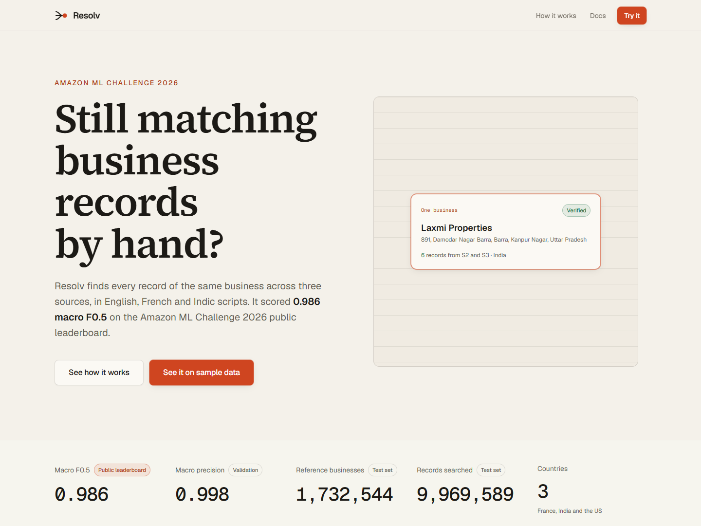
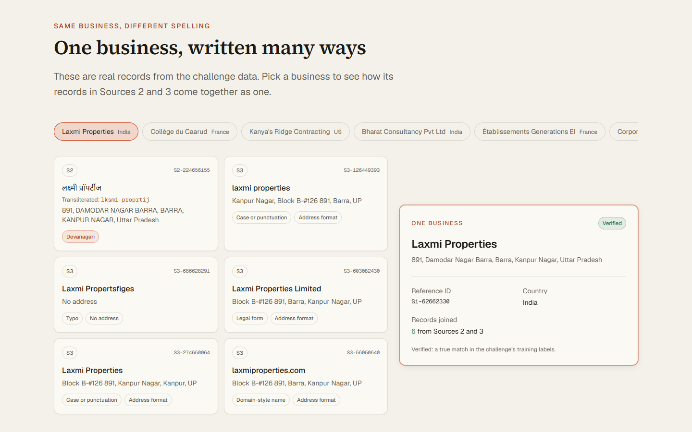
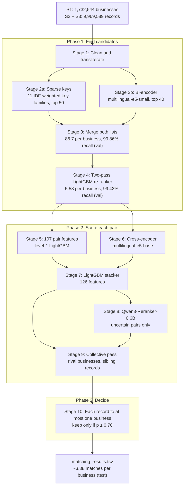
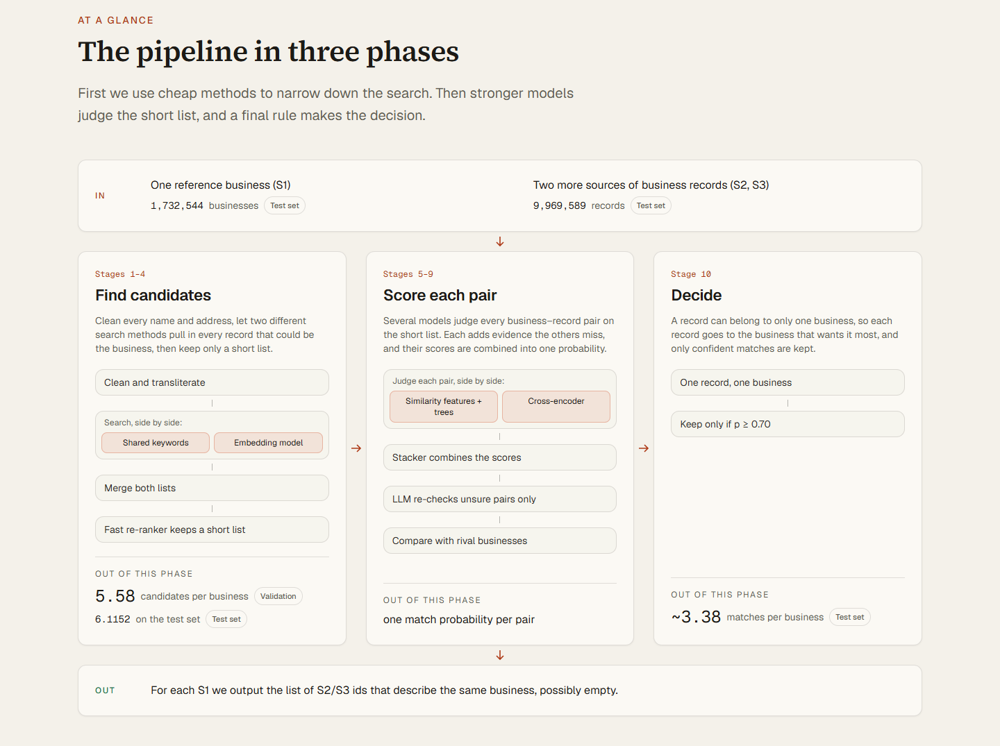
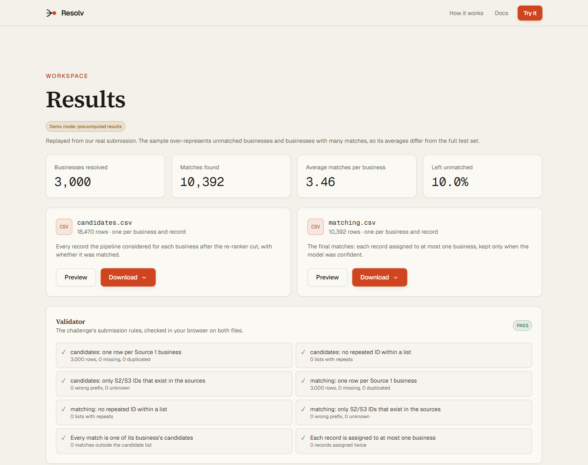

<div align="center">

# Resolv

**One business, however it's written.**

Business entity resolution across 1.7 million businesses and nearly 10 million records,<br>
in English, French and Indic scripts. Built by team **The Epoch Warriors** for the **Amazon ML Challenge 2026**.


</div>



## At a glance

| | |
|---|---|
| **Rank** | 345th out of 32,000 participating teams |
| **Public leaderboard** (macro F0.5) | **0.985978** |
| **Validation** (macro F0.5 / precision / recall) | 0.99158 / 0.99803 / 0.97776 |
| **Test data** | 1,732,544 reference businesses and 9,969,589 records from India, the US and France |
| **Models** | multilingual-e5-small bi-encoder, multilingual-e5-base cross-encoder, fine-tuned Qwen3-Reranker-0.6B, LightGBM |

Validation scores are measured on 100,000 held-out training businesses from a test-like version of the training data ([why](#3-make-validation-look-like-the-test-set)). The leaderboard score is from our submission history.

## The problem

> Can you determine whether two noisy, incomplete business records from different sources refer to the same real-world business?

E-commerce platforms collect business data from many sources, and much of it is redundant: the same business keeps showing up, written differently each time. One source has the full name, another a short form, another a typo, and in India many names are written in Hindi or another Indian script.

The challenge gave us three sources:

- **Source 1 (S1)** is the reference list of businesses.
- **Sources 2 and 3 (S2, S3)** are records collected from elsewhere.
- **The task:** for every S1 business, list every S2/S3 record that is the same business. Some have many matches, some have none.

Here is one real business from the training data, with all six of its records:

| source | name | what's different |
|---|---|---|
| **S1** | Laxmi Properties | the reference record |
| S2 | लक्ष्मी प्रॉपर्टीज | Devanagari script |
| S3 | laxmi properties | lowercase, address reordered |
| S3 | Laxmi Propertsfiges | spelling mistake, no address |
| S3 | Laxmi Properties Limited | legal form added |
| S3 | Laxmi Properties | extra whitespace, different address format |
| S3 | laxmiproperties.com | written as a website |



**What made it hard**

- **Scripts:** 23.64% of India S2 names in the test set are in an Indic script.
- **Legal forms and honorifics:** "Pvt Ltd" vs "Private Limited" vs "प्राइवेट लिमिटेड", "M/s", "Smt".
- **Missing addresses:** 2.28% to 3.68% of S2/S3 records have none.
- **Shared names:** 29.5% to 44.2% of S1 businesses share their name with another business in the same country.
- **An unseen country:** France is about 15% of the test set and has no training labels at all.
- **The metric:** macro F0.5 per business, which weighs precision about twice as much as recall. A business with no true match scores 1 only if we predict nothing, so one wrong guess costs a full point.

## How it works

The pipeline has ten stages in three phases. Cheap methods narrow the search first, stronger models judge the short list, and a final rule makes the decision. Comparing every business with every record would mean about 17 trillion pairs; we never compare records across countries.



<details>
<summary><b>All ten stages in detail</b></summary>

| # | stage | what it does |
|---|---|---|
| 1 | **Clean** | NFKC normalisation and [anyascii](https://github.com/anyascii/anyascii) transliteration of Indic scripts. Legal forms ("Pvt Ltd" = "Private Limited"), honorifics, phone numbers and domain suffixes are canonicalised or stripped; street words, state names and house numbers are normalised. Each name also gets a phonetic **consonant skeleton**, so different spellings of the same sound still meet. |
| 2a | **Sparse keys** | Hashed keys from 11 families (name tokens and token pairs, squashed name and prefix, address tokens and bigrams, PIN/ZIP, house numbers, skeleton, name × locality, number × street). Rare keys count more (IDF); keys with more than 300 postings are dropped. Top 50 records per business. |
| 2b | **Bi-encoder** | `intfloat/multilingual-e5-small`, fine-tuned with an in-batch contrastive loss on same-country batches. It reads the raw script, so Hindi and English spellings land close together. Top 40 records per business, plus the top 3 businesses per record. |
| 3 | **Merge** | Union of both lists: 86.7 candidates per business, containing 99.86% of true pairs (validation). |
| 4 | **Re-rank and cut** | Pass 1 is a 39-feature LightGBM. Pass 2 adds 13 hints from pass 1: how strongly *other* businesses claim the same record, sibling evidence from the business's confident records, and acronym matches. A rule tuned under a budget of 6 candidates per business keeps 5.58 (validation) / 6.12 (test), with 99.43% of true pairs. Output: `candidate_pairs.tsv`. |
| 5 | **Pair features** | 107 features: name and address similarities (token-set, Levenshtein, Jaro-Winkler, character n-gram TF-IDF), legal-form agreement, ZIP/state/number agreement, script flags, and how many businesses share the name or address. A level-1 LightGBM turns them into a first probability. |
| 6 | **Cross-encoder** | `intfloat/multilingual-e5-base` reads both records side by side in their original scripts. Slower but more accurate than the bi-encoder, so it runs only on the short list. |
| 7 | **Stacker** | A LightGBM over 126 features: the 107 pair features, 10 competition features from level-1 and 9 from the cross-encoder. |
| 8 | **LLM reranker** | `Qwen/Qwen3-Reranker-0.6B`, fine-tuned on 400,000 of our pairs, re-checks only pairs where the stacker is unsure (p between 0.02 and 0.98). It knows things the string features don't, like "FBP" standing for "Fun Boutique Primaire SAS", and French abbreviations. |
| 9 | **Collective pass** | A final LightGBM (27 features) that looks at the bigger picture: which rival businesses want the same record, and how the record compares with the business's other confident matches. |
| 10 | **Assign** | Each record goes only to the business that gives it the highest probability, and is kept only if p ≥ 0.70. Output: `matching_results.tsv`. |

</details>

**Models**

| model | role | parameters | licence |
|---|---|---|---|
| [`intfloat/multilingual-e5-small`](https://huggingface.co/intfloat/multilingual-e5-small) | bi-encoder retrieval | 118M | MIT |
| [`intfloat/multilingual-e5-base`](https://huggingface.co/intfloat/multilingual-e5-base) | cross-encoder | 278M | MIT |
| [`Qwen/Qwen3-Reranker-0.6B`](https://huggingface.co/Qwen/Qwen3-Reranker-0.6B) | LLM reranker on uncertain pairs | 596M | Apache-2.0 |
| [LightGBM](https://github.com/microsoft/LightGBM) | re-ranker, level-1, stacker, collective pass | – | MIT |

No external data or lookup services were used, and no test labels exist or were used.

## Results

**How the score improved** (each row is a submitted version)

| version | what changed | validation F0.5 | public leaderboard |
|---|---|---|---|
| v1 | 8 sparse key families, logistic re-ranker, e5-small cross-encoder | 0.96310 * | ~0.94 |
| v2 | test-like training (ghost S1), dense retrieval, e5-base cross-encoder, LightGBM stack | 0.99013 | 0.981874 |
| v3b | two-pass re-ranker with record-side competition, collective pass | 0.99098 | 0.9834 |
| v4a | + Qwen3-Reranker on uncertain pairs (p in [0.05, 0.95]) | 0.99153 | 0.985619 |
| **v4b (final)** | wider Qwen band (p in [0.02, 0.98]) | **0.99158** | **0.985978** |

\* v1 was validated on the raw training distribution, which is why it looked better on validation than on the leaderboard.

**What each matcher adds** (validation, same candidates)

| matcher | macro F0.5 |
|---|---|
| level-1 LightGBM, features only | 0.98466 |
| e5-base cross-encoder alone | 0.98545 |
| stacker | 0.99093 |
| + collective pass | 0.99098 |
| + Qwen3-Reranker-0.6B (v4a) | 0.99153 |
| final run (v4b) | 0.99158 |
| *perfect matcher on our candidates* | *0.99846* |

The official validator passes on both submitted files: 1,732,544 rows each, every match inside its business's candidate list, and no record assigned to two businesses.

## What we learned

#### 1. Blocking sets the ceiling

Our first version's candidate lists missed about 7% of true matches, so even a perfect model could not have scored above 0.9715. Adding the multilingual bi-encoder and three new key families raised that ceiling to 0.99792, and was a big part of the jump from ~0.94 to 0.981874 on the leaderboard. The two retrievers are complementary:

| candidate set (validation) | per business | pair recall | best possible F0.5 |
|---|---|---|---|
| sparse keys, top 50 | 49.771 | 0.9575 | 0.98418 |
| bi-encoder, top 40 | 40.0 | 0.9977 | 0.99932 |
| union | 86.711 | 0.9986 | 0.99959 |
| **after the re-ranker cut** | **5.58** | **0.9943** | **0.99846** |

#### 2. Multilingual names and typos need more than one fix

Rules alone miss things, and so do models alone. We transliterated Indic scripts with anyascii and kept a phonetic consonant skeleton, so "Anand Foods Private Limited" and its Bengali record "আনন্দ ফুডস প্রাইভেট লিমিটেড" both reduce to the skeleton `and fds`. Fuzzy string features absorb typos, while the bi-encoder, cross-encoder and Qwen read the original, untransliterated text and catch what the rules miss.

#### 3. Make validation look like the test set

v1 scored 0.963 on validation but about 0.94 on the leaderboard. The reason: 26.0% of training records match no business, but we estimated about 39.8% in the test set. So we removed 20% of training businesses on purpose ("ghost S1"), turning their records into unmatched noise. That gave a training set with 40.79% unmatched records, and every model and threshold from v2 on was fitted on it.

#### 4. One record belongs to one business

A record can match at most one business, so every learned stage also sees how strongly *other* businesses claim the same record. These competition features rank at or near the top of every model's feature importance, and in v3, together with sibling evidence, they recovered 854 of the 2,346 true pairs the v2 cut had dropped.

#### 5. Use the expensive model only where it's needed

The Qwen reranker scores only the pairs the stacker is unsure about, which keeps inference cheap. It still gave our largest late gain: 0.9834 → 0.985619 on the leaderboard.

## Where it still makes mistakes

Of the 0.00842 F0.5 still lost on validation, most is recall: true records missed (0.00527) and businesses left empty (0.00151). The main cause is records **with no address that share their name with another business**: from the text alone there is no way to tell which business they belong to. Address-less pairs in the 0.40–0.70 probability range are right only 52% of the time, below the break-even precision, and 97.4% of the businesses we leave empty truly have no match. So Resolv abstains on them instead of guessing.

France has no labels, so its accuracy can only be judged indirectly: French businesses receive 3.321 matches on average with 5.75% left empty, close to India (3.39, 5.76%) and the US (3.385, 5.82%).

The [full write-up](Website/The_Epoch_Warriors_submission/Documentation_template.md) has every feature, hyperparameter, ablation and diagnostic.

## The website

`Website/app` is a static web app that explains the solution and replays our real submission.

- **Home:** the problem, headline numbers and real examples from the data.
- **How it works:** the three phases, all ten stages, the candidate funnel, the score history, the metric and the error analysis.
- **Docs:** the full write-up, rendered.
- **Try it:** upload three source files (CSV, TSV or Excel), watch the ten stages run, then validate, preview and download the results as CSV, Excel, PDF, Word or the challenge's TSV format. A match explorer shows, for any business, which records were matched and which candidates were turned down.

| | |
|---|---|
|  |  |

**Demo mode.** The trained models were not saved after the challenge, so the site does not run inference. It replays our real submitted output for a stratified sample of 3,000 test businesses (1,000 per country), and every result carries a "Demo mode: precomputed results" badge. Uploaded files are parsed and checked in the browser and never sent anywhere; the site then says live inference isn't connected and offers the sample instead. The UI talks to the pipeline through a single `Resolver` interface, so a real backend can be plugged in later (see [HANDOVER.md](HANDOVER.md#demo-mode-and-the-resolver)).

**Every number is checked.** Each figure on the site is stored in `src/content/` with the exact sentence it comes from in the write-up. `npm run check-facts` runs before every build and fails it if a quote is missing or doesn't match the value.

**Stack:** Vite, React 19, TypeScript (strict), Tailwind CSS 4, React Router, Motion, PapaParse, SheetJS, TanStack Virtual, jsPDF and docx. Fully client-side.

### Run it locally

Requires Node.js 22 or newer.

```bash
cd Website/app
npm ci          # installs exact versions; SheetJS comes from cdn.sheetjs.com
npm run dev     # http://localhost:5173
```

| command | what it does |
|---|---|
| `npm run dev` | development server with hot reload |
| `npm run build` | fact check, type check, then a production build into `dist/` |
| `npm run preview` | serves `dist/` on http://localhost:4173 |
| `npm run lint` | ESLint |
| `npm run smoke` | Playwright test of every page at 360, 768 and 1440 px, plus the full sample data → results → download flow (run `preview` first) |
| `npm run demo-data` | regenerates the sample in `public/demo/` from the full submission files (not included in this repo) |

The build is a static single-page app, so it deploys to Vercel or Netlify with `Website/app` as the root directory. [HANDOVER.md](HANDOVER.md) covers deployment, Windows setup and known limits in detail.

## Reproducing the pipeline

The pipeline code is in [`Website/The_Epoch_Warriors_submission/code/business_entity_resolution`](Website/The_Epoch_Warriors_submission/code/business_entity_resolution), and its [README](Website/The_Epoch_Warriors_submission/code/business_entity_resolution/README.md) lists every command with run times.

- **Data:** the challenge dataset (about 2.4 GB) is not included. Point `ER_DATA_DIR` at the folder with the seven TSV files.
- **Environment:** Python 3.12; `pip install -r requirements.txt` (PyTorch is pulled from the CUDA 12.8 index).
- **Hardware:** the reference run used one A100 40 GB with 30 vCPUs and 216 GB RAM. A GPU is needed for the bi-encoder, the cross-encoder and Qwen; everything else runs on the CPU.
- Every stage caches its outputs and resumes after an interruption. Tree models and data splits are seeded (42); GPU training is not bit-exact, so a re-run matches within run-to-run noise.

## Repository layout

```
.
├── README.md
├── HANDOVER.md                         website setup, deployment and maintenance notes
├── CLAUDE.md                           project rules for Claude Code
├── docs/images/                        screenshots used in this README
├── Resources/student_resource/         challenge README, documentation template, official validator
└── Website/
    ├── The_Epoch_Warriors_submission/  the submission as handed in
    │   ├── Documentation_template.md   full write-up: method, ablations, error analysis
    │   └── code/business_entity_resolution/
    │       ├── README.md               step-by-step reproduction
    │       ├── requirements.txt
    │       └── src/                    er_v2 pipeline modules, notebooks, validator
    └── app/                            the Resolv website
        ├── public/demo/                sampled demo data (generated)
        ├── scripts/                    check-facts, build-demo-data, smoke test
        └── src/                        pages, components, content (every fact), resolver, exports
```

## Team

**The Epoch Warriors**: Rajveer Gupta, Manas Tiwari, Hrutuparna Bedekar and Sutikshan Upman.

Built for the Amazon ML Challenge 2026, alongside our mid-semester exams.
